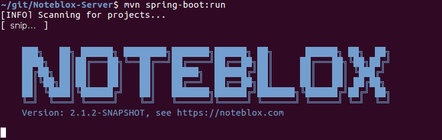
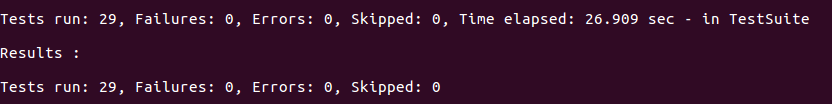

NoteBLOX - In Application Ticketing
===================================
We think the job ticketing process is broken. Or at least, it’s limping along. We think that the inbound emails, phones and the difficulty in submitting Jira (or GitHub Issues) for your GitHub applications can be improved. NoteBLOX is the world's first In Application Ticketing System.

The whole idea of In Application Ticketing (NoteBLOX) revolves around users not having to leave what they are doing.

### Without In Application Ticketing
Let’s say you have written a CRM system (could be any system) in GitHub and there is a problem. Does it make sense to have users make a phone call or send an email or log it in Jira or GitHub? It really makes no sense. Fields must be filled out, screenshots made, etc.. I don’t need to go through all the details that must be shared - DOM tree, click path, device, browser and more. It's a PITA (pain in the ass).

### With In Application Ticketing
Right from the system (CRM, PO system, Insurance, etc...) the user should be able to just demark the issue and have the technical information captured automatically.

Using NoteBLOX, users can bypass email, calls and Jira/GitHub Issues...and submit issues directly. 

* NoteBLOX brings the ticketing process closer to the user, things are faster and smoother and less problematic.
* Users report issues with more accuracy.
* Users spend less time reporting issues.
* GitHub Developers spend less time understanding what the user is describing.
* GitHub Developers ask fewer questions on technical details.

Most of all, Users don't need to leave the application with the issue. They can do it right within your application.

### This is


[](https://travis-ci.org/Noteblox/Noteblox-Server)

# NoteBLOX Server

<!-- TOC depthFrom:2 depthTo:6 withLinks:1 updateOnSave:1 orderedList:0 -->

- [Howto](#howto)
	- [Prerequisites](#prerequisites)
	- [Checkout](#checkout)
	- [Build](#build)
	- [Run](#run)
	- [Run Integration Tests](#run-integration-tests)
- [Architecture](#architecture)
- [License](#license)

<!-- /TOC -->

NoteBLOX is an on-page support and collaboration tool for websites.

## Documentation

- [Project pages](https://noteblox.github.io/Noteblox-Server/)
- [REST API reference](https://noteblox.github.io/Noteblox-Server/restapi.html)

## Build and Run

### Prerequisites

- Java Development Kit 1.8 (either OpenJDK or Oracle)
- Apache Maven 3.3.9

### Checkout

```
git clone https://github.com/Noteblox/Noteblox-Server.git
```

### Build

```
mvn  clean install
```

### Run

```
mvn  spring-boot:run
```



### Run Integration Tests

```
mvn  clean install -P ci
```


## Architecture

<pre>
                    +-------------------------+   +---------------------+   +------------------+
 Browser, App,      | RESTful SCRUD           |   | Content negotiation |   | Websockets       |
 or other Client    +-------------+-----------+   +-----------+---------+   +-------+----------+
                                  |                           |                     |
--------------------------------- | ------------------------- | ------------------- | -----------
                                  |                           |                     |
                      JSON+HATEOAS or JSON-API 1.x            |                     |
 Network              with RSQL/FIQL or URL params            |                   STOMP
                                  |                           |                     |
                                  |                           |                     |
--------------------------------- | ------------------------- | ------------------- | -----------
                                  |                           |                     |
                    +-------------+---------------------------+----------+  +-------+----------+
                    |     <strong>Controller</strong>                                     +--+ Message Broker   |
                    +--------------------------+-------------------------+  +-------+----------+
                                               |                                    |
 Restdude                                      |                                    |
                    +--------------------------+------------------------------------+----------+
                    |                                    <strong>Service</strong>                               |
                    +--------+--------------------+---------------------+---------------+------+
                             |                    |                     |               |
                             |                    |                     |               |
                    +--------+-------+ +----------+-----------+ +-------+-------+ +-----+------+
                    |     <strong>Repository</strong> | | FileService (FS, S3) | | EmailService  | | Misc Util  |
                    +----------------+ +----------------------+ +---------------+ +------------+
</pre>


## License

NoteBLOX is distributed under the <a href="https://www.gnu.org/licenses/agpl-3.0-standalone.html">GNU Affero General Public License</a> 
